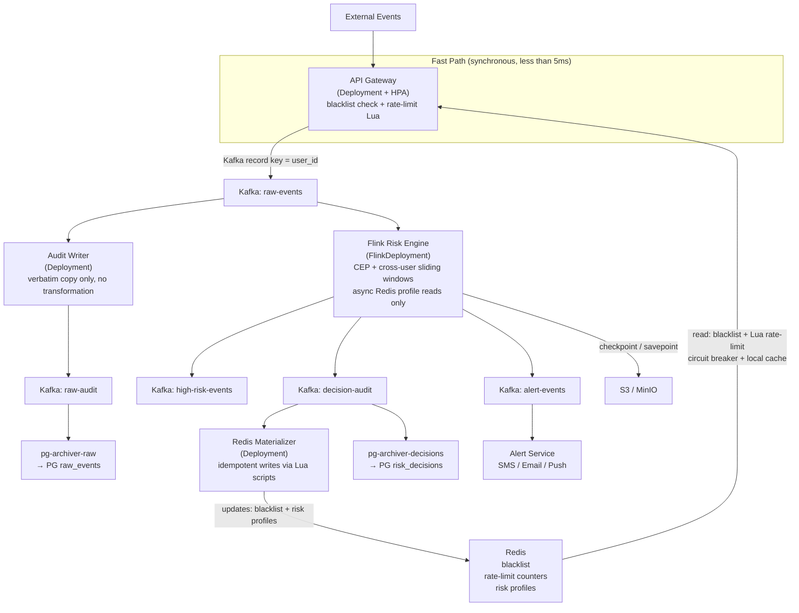

# RealRisk — Real-Time Risk Management System
## Project Summary for Claude Code

---

## 1. Project Overview

**RealRisk** is a real-time financial transaction risk control system. It detects fraud and anomalous behavior by processing high-velocity event streams, applying rule-based scoring in real time, and blocking suspicious transactions within milliseconds.

---

## 2. Core Tech Stack

| Layer | Technology | Role |
|---|---|---|
| Event ingestion | **Kafka** | Receive all transaction/login/behavior events |
| Stream processing | **Flink** | Real-time CEP rules, sliding window aggregation |
| Hot data store | **Redis** | Rate-limit counters, blacklists, user risk profiles |
| Persistent store | **PostgreSQL** | Rules, audit logs, reports |
| State backend | **S3 / MinIO** | Flink checkpoint & savepoint storage |
| Schema management | **Confluent Schema Registry** | Avro schema versioning for Kafka messages |
| Containerization | **Docker** | Multi-stage builds, non-root images |
| Orchestration | **Kubernetes** | Deployment, StatefulSet, HPA, ConfigMap/Secret |
| CI/CD | **GitHub Actions** | Build → test → push image → update K8s |
| Testing | **Testcontainers** | Real Kafka/Redis/PG containers in integration tests |
| Monitoring | **Prometheus + Grafana** | Metrics, dashboards, alerting |

---

## 3. Kafka Design

### Topics

| Topic | Partitions | Config | Purpose |
|---|---|---|---|
| `raw-events` | 16 | delete, retention 30d | All raw transaction/login/behavior events |
| `high-risk-events` | 4 | delete | Written by Flink when risk score exceeds threshold |
| `alert-events` | 4 | delete | Triggers SMS/email/push notifications |
| `raw-audit` | 8 | delete, retention 30d | Raw event archive — written by audit-writer from raw-events |
| `decision-audit` | 8 | delete, retention 90d | Risk decisions — written by Flink (one record per evaluated event) |
| `rule-updates` | 1 | **compact** | Risk rule changes; Log Compaction keeps latest per rule_id |

> **Why two audit topics**: `raw-audit` and `decision-audit` have different writers, different retention needs, and different consumers. Merging them into one `audit-log` creates semantic ambiguity (which records are raw input vs. evaluated output?) and couples the audit-writer to Flink's output format. `pg-archiver` consumes both independently.

### Partition Strategy

- **`raw-events`**: Kafka record key = `user_id` (string). The default Kafka partitioner applies `murmur2(key) % numPartitions`, guaranteeing all events for the same `user_id` land on the same partition and are processed in-order by the same Flink task. Do **not** compute the partition manually — let the partitioner handle it so behaviour is consistent across clients and library versions.
- **`rule-updates`**: single partition + Log Compaction — new Flink nodes replay full rule set on startup, then consume incremental changes.

### Consumer Groups

- `flink-risk-engine` — consumes `raw-events`, performs real-time rule evaluation; writes decisions to `decision-audit`
- `audit-writer` — consumes `raw-events` independently; writes verbatim to `raw-audit` (no transformation)
- `pg-archiver-raw` — consumes `raw-audit`; archives to PostgreSQL `raw_events` table
- `pg-archiver-decisions` — consumes `decision-audit`; archives to PostgreSQL `risk_decisions` table
- Each group maintains its own offset and fails/recovers independently.

### Key Configurations

```properties
# raw-events
retention.ms=2592000000       # 30 days
segment.ms=86400000           # 1-day rolling segments

# decision-audit
retention.ms=7776000000       # 90 days (longer: compliance queries reach back further)

# rule-updates
cleanup.policy=compact
min.cleanable.dirty.ratio=0.1
delete.retention.ms=86400000  # tombstones kept 24h before compaction discards them
```

> **Kafka listener configuration** is managed by Strimzi via the `Kafka` CRD — do not hand-write `advertised.listeners`. Strimzi resolves per-pod DNS names and generates correct listener configs on each broker automatically.

### Exactly-Once with Flink

```java
KafkaSource.<Event>builder()
  .setStartingOffsets(OffsetsInitializer.committedOffsets())
  // Required for end-to-end exactly-once: only read messages committed
  // by transactional producers; without this, the source may consume
  // uncommitted messages that are later aborted.
  .setProperty("isolation.level", "read_committed")
  .build();

KafkaSink.<Decision>builder()
  .setDeliveryGuarantee(DeliveryGuarantee.EXACTLY_ONCE)
  .setTransactionalIdPrefix("flink-risk-")
  .build();
```

---

## 4. Redis Design

### Data Structures & TTL Strategy

### Two-Tier Decision Architecture

Redis and Flink serve **different roles** and are not redundant:

| Tier | Executor | Latency | What it detects |
|---|---|---|---|
| **Fast path** | Redis Lua (synchronous, in API Gateway) | < 5ms | Per-user rate limit, confirmed blacklist |
| **Slow path** | Flink (asynchronous, stream processing) | seconds | Cross-user CEP patterns, long-window aggregations, ML scoring |

The fast path blocks the current request immediately. The slow path updates the blacklist in Redis (via Redis Materializer), so the *next* request from a fraudulent user is blocked at the fast path.

There is **no overlap**: Redis tracks per-user simple counters; Flink detects patterns that require stateful correlation across multiple users or longer time horizons (e.g. "same merchant hit by 10 different users in 5 minutes"). Flink does **not** replicate the per-user rate-limit logic already in Redis.

#### Sorted Set — Sliding Window Rate Limiting (Fast Path)

```lua
-- risk_check.lua (atomic: called via EVALSHA)
local key       = KEYS[1]           -- "risk:txn:{user_id}"
local now       = tonumber(ARGV[1]) -- current timestamp ms
local window    = tonumber(ARGV[2]) -- window size ms (e.g. 60000)
local limit     = tonumber(ARGV[3]) -- max allowed count (e.g. 5)
local dedupeKey = ARGV[4]           -- request_id (stable across producer retries)

redis.call('ZADD', key, now, dedupeKey)                        -- 1. record event
redis.call('ZREMRANGEBYSCORE', key, 0, now - window)           -- 2. evict outside window
redis.call('EXPIRE', key, math.ceil(window * 2 / 1000))        -- 3. TTL = 2× window (window is ms, EXPIRE takes seconds)

local count = redis.call('ZCARD', key)
if count > limit then
  return {1, count}   -- {blocked=true, count}
end
return {0, count}     -- {blocked=false, count}
```

**ZADD member = `request_id`, not `event_id`**: A producer retry generates a new `event_id` but carries the same `request_id`. Using `event_id` would count one user action as two rate-limit hits. `request_id` is stable across retries, so a retried request replaces its previous ZADD entry (same score update, no double-count).

**Critical ordering**: ZADD must come before ZREMRANGEBYSCORE — reversing them can cause the current event to be immediately evicted.

**Why Lua over distributed lock**: The entire read-check-write is atomic inside Redis's single thread. A distributed lock requires 5+ round trips, spin-retry logic, token validation, and watchdog renewal. Lua requires 1 round trip with zero race conditions.

#### String + TTL — Tiered Blacklist

Severity levels (higher = more severe):

```
# Level 1 — Rate limit:   60s
# Level 2 — Short ban:    3600s   (1h)
# Level 3 — Medium ban:   86400s  (24h)
# Level 4 — Long ban:     604800s (7d)
# Level 5 — Permanent:    no TTL  (manual review required)
```

Ban writes use a Lua script to atomically compare severity levels, ensuring a more-severe ban always wins regardless of arrival order:

```lua
-- set_blacklist.lua
local key      = KEYS[1]           -- "blacklist:{user_id}"
local reason   = ARGV[1]           -- e.g. "FRAUD_CONFIRMED"
local severity = tonumber(ARGV[2]) -- 1..5
local ttl      = tonumber(ARGV[3]) -- seconds; 0 = permanent

local existing = redis.call('GET', key)
if existing then
  -- value format is "REASON:SEVERITY", parse the numeric suffix
  local cur_severity = tonumber(string.match(existing, ':(%d+)$'))
  if cur_severity and cur_severity >= severity then
    return 0  -- existing ban is same or more severe, do not overwrite
  end
end

local value = reason .. ':' .. severity
if ttl == 0 then
  redis.call('SET', key, value)
else
  redis.call('SET', key, value, 'EX', ttl)
end
return 1
```

> **Why not `NX`**: `NX` only prevents any overwrite. If a 60s rate-limit ban arrives before a 7-day fraud ban, `NX` blocks the fraud ban permanently until the 60s TTL expires — the wrong behavior. The Lua script does a severity comparison, so a more-severe ban always overwrites a less-severe one atomically.

#### Hash — User Risk Profile

```redis
HSET profile:{user_id}
  risk_score    72
  last_ip       "10.0.1.5"
  device_count  3
  txn_30d       145
  last_seen     1716300000

# Update single field without touching others
HSET profile:{user_id} risk_score 85
```

#### Keyspace Notifications — TTL Expiry Events

```properties
# redis.conf
notify-keyspace-events Ex
```

```python
pubsub = redis.pubsub()
pubsub.psubscribe('__keyevent@0__:expired')

for msg in pubsub.listen():
    key = msg['data']
    if key.startswith('blacklist:'):
        user_id = key.split(':')[1]
        send_unblock_notification(user_id)
        reset_risk_counters(user_id)
```

**Note**: Keyspace notifications are at-most-once. When a blacklist key expires, Redis has already removed it — the user is no longer blocked by Redis. What gets lost if the notification is missed is the **side-effect work**: sending the unblock notification, resetting risk counters, and marking the ban as cleared in PostgreSQL. Without a fallback, `audit_bans.cleared_at` stays NULL and risk counters remain stale.

**Required: periodic reconciliation job** (runs every 5 minutes):
```python
# Uses a dedicated audit_bans table with an index on (expires_at, cleared_at).
# Do NOT full-scan the audit log — that table is append-only and grows unboundedly.
def reconcile_expired_bans():
    expired = pg.query("""
        SELECT user_id FROM audit_bans
        WHERE expires_at < NOW() AND cleared_at IS NULL
        -- index: CREATE INDEX ON audit_bans (expires_at) WHERE cleared_at IS NULL
    """)
    for row in expired:
        # Redis key already gone — just do the cleanup work
        reset_risk_counters(row.user_id)
        pg.execute(
            "UPDATE audit_bans SET cleared_at = NOW() WHERE user_id = %s AND cleared_at IS NULL",
            row.user_id
        )
```

`reset_risk_counters` must be idempotent: calling it twice for the same user must be safe.

#### Pipeline — Batch Writes in Redis Materializer

```python
pipe = redis.pipeline()
for decision in batch:
    pipe.hset(profile_key, ...)
    # blacklist writes still use the severity-compare Lua script when a ban is needed
    # rate-limit counters are NOT updated here; they are owned by the API Gateway fast path
pipe.execute()
# All commands sent in one network round trip
```

### Key Naming Convention

```
risk:txn:{user_id}        # Sorted Set, sliding window
blacklist:{user_id}       # String, ban status
profile:{user_id}         # Hash, risk profile
lock:risk:{user_id}       # String, distributed lock (only when cross-store atomicity needed)
```

---

## 5. Flink Design

- **Source**: `KafkaSource` consuming `raw-events`, keyed by `user_id`
- **State backend**: RocksDB (incremental checkpoints to S3/MinIO)
- **Checkpoint interval**: 30s
- **Window types**:
  - Sliding window: cross-user pattern aggregation (e.g. "same merchant_id hit by > 10 distinct users in 5 min")
  - Tumbling window: periodic risk score recalculation per user
- **CEP**: Multi-step fraud sequences (e.g. failed login → password reset → large withdrawal within 10 min)
- **Feature lookup**: Async Redis reads for user profile enrichment (read-only; never write to Redis directly)
- **Sink**: Writes to `high-risk-events`, `alert-events`, `decision-audit` topics — Kafka only
- **Does NOT**: replicate per-user rate-limit counting — that is Redis's fast-path responsibility (see Section 4)

### Exactly-Once Boundary

Flink's exactly-once guarantee applies **only to Kafka sinks**. Redis is not a transactional participant in Flink checkpoints, so Redis writes are explicitly excluded from the exactly-once scope:

```
Exactly-once:  Kafka source → Flink state → Kafka sink (decision-audit, high-risk-events, alert-events)
At-least-once: decision-audit → [Redis Materializer] → Redis (must be idempotent)
```

**Redis Materializer** is a separate lightweight service that consumes `decision-audit` and updates Redis. Because Kafka consumer groups support at-least-once delivery, all Redis writes must be idempotent:

| Write | Idempotency mechanism |
|---|---|
| Rate-limit counter (Sorted Set) | Owned by API Gateway fast path; `ZADD` uses `request_id` as member |
| Blacklist | Lua severity-compare script — re-applying same severity is a no-op |
| Risk profile (Hash) | `HSET` is naturally idempotent for deterministic field values |

> **Why not have Flink write Redis directly**: Flink TaskManagers may replay operators after a failure. Redis has no rollback — a write applied twice stays twice. Routing through Kafka + materializer makes the boundary explicit and gives the materializer its own offset to resume from.

### Flink on Kubernetes

Deployed via **Flink Kubernetes Operator** using `FlinkDeployment` CRD. The Operator handles JobManager/TaskManager lifecycle, automatic recovery, and savepoint management.

```yaml
# Flink config (flink-conf.yaml)
state.backend: rocksdb
state.checkpoints.dir: s3://rr-flink-state/checkpoints
state.savepoints.dir: s3://rr-flink-state/savepoints
s3.endpoint: http://minio:9000          # local dev
s3.path-style-access: true
```

---

## 6. PostgreSQL Design

- **`rules` table**: Risk control rule definitions; business source of truth; distributed to Flink via `rule-updates` Kafka topic
- **`raw_events` table**: Verbatim archive of all inbound events; populated by `pg-archiver-raw` consuming `raw-audit` topic; index on `(user_id, timestamp)`
- **`risk_decisions` table**: One record per Flink-evaluated event; populated by `pg-archiver-decisions` consuming `decision-audit` topic; index on `(user_id, created_at)`
- **`audit_bans` table**: One record per blacklist entry with `expires_at` and `cleared_at`; used by reconciliation job; partial index `ON audit_bans (expires_at) WHERE cleared_at IS NULL`
- **Reports**: Historical aggregations across `risk_decisions` and `raw_events`; compliance queries
- **Operator**: **CloudNativePG** — do not hand-write a StatefulSet
- **Connection pooling**: Deploy **PgBouncer** in transaction-pooling mode in front of PostgreSQL. Multiple Flink TaskManagers + pg-archiver instances exhaust `max_connections` without it.

### Rule Source of Truth

**PostgreSQL is the business source of truth for rules.** The `rule-updates` Kafka topic is a distribution channel — a compacted projection of what is in PostgreSQL. These are different roles:

| Store | Role |
|---|---|
| PostgreSQL `rules` table | Authoritative: CRUD UI writes here, version history, enabled/deleted flags |
| `rule-updates` Kafka topic | Distribution: Flink reads from here on startup and incremental updates |

Rules table must include: `rule_id`, `version`, `enabled`, `deleted_at`, `payload` (rule definition JSON).

**Tombstone semantics**: to delete a rule, publish a message with `key=rule_id` and `value=null` to `rule-updates`. Flink consumers must handle null-value records as deletions. Log Compaction will eventually discard the tombstone after `delete.retention.ms`.

### Rule Distribution — Outbox Pattern

Rule changes go through the **Transactional Outbox** pattern to prevent the dual-write problem (updating PG and Kafka in separate transactions):

```
API/Admin UI
    │
    ▼
PostgreSQL transaction:
  UPDATE rules SET ...          ← rule change
  INSERT INTO rule_outbox ...   ← outbox record (same transaction)
    │
    ▼
Outbox relay (Debezium CDC or polling relay):
  reads rule_outbox → publishes to rule-updates topic → marks outbox row as sent
```

This guarantees that a rule change is never published to Kafka without being committed to PostgreSQL, and never committed to PostgreSQL without eventually being published to Kafka.

### Rule Bootstrap Procedure

On first deploy (or after disaster recovery that wipes the topic), seed from PostgreSQL:

```bash
# Run once; idempotent — republishing existing rule_ids is safe due to Log Compaction
./scripts/seed_rules.sh
# Reads all non-deleted rules from PG, publishes each keyed by rule_id.
# Publishes null-value tombstones for deleted rules.
```

---

## 7. Schema Registry

All Kafka messages use **Avro** serialization with Confluent Schema Registry.

```json
{
  "type": "record",
  "name": "RiskEvent",
  "namespace": "com.realrisk",
  "fields": [
    {"name": "event_id",      "type": "string"},
    {"name": "request_id",    "type": "string"},
    {"name": "user_id",       "type": "string"},
    {"name": "event_type",    "type": "string"},
    {"name": "timestamp",     "type": "long", "logicalType": "timestamp-millis"},
    {"name": "amount_cents",  "type": "long"},
    {"name": "currency",      "type": "string"},
    {"name": "ip_address",    "type": ["null", "string"], "default": null},
    {"name": "device_fp",     "type": ["null", "string"], "default": null},
    {"name": "merchant_id",   "type": ["null", "string"], "default": null},
    {"name": "counterparty",  "type": ["null", "string"], "default": null},
    {"name": "source",        "type": "string"}
  ]
}
```

> **Why `amount_cents` as `long`**: `double` introduces floating-point precision errors (e.g. `0.1 + 0.2 ≠ 0.3`). All monetary values are stored as the smallest currency unit (e.g. cents for USD). Producers convert at ingestion; consumers convert back for display only.
>
> **Why `logicalType: timestamp-millis`**: Without it, the `long` field is an opaque integer. The logicalType annotation lets serialization tooling, Schema Registry documentation, and downstream consumers correctly interpret the unit as epoch milliseconds.
>
> **Why `event_type` as `string`, not Avro enum**: Adding a new enum symbol under `BACKWARD` compatibility requires all consumers to upgrade before the new producer deploys — operationally difficult in a financial system where event types expand frequently (e.g. adding `CARD_ISSUE`, `KYC_CHECK`). Using `string` keeps the Avro schema stable; validation is enforced at the application layer (allowlist in the API Gateway validator: `TRANSACTION | LOGIN | WITHDRAWAL | TRANSFER | BEHAVIOUR`). Adding a new type is a config change, not a schema migration.
>
> **Why `request_id`**: Separate from `event_id`. `request_id` is set by the API caller and enables end-to-end tracing across retries (same `request_id`, different `event_id` if the producer retried). Needed for deduplication in the materializer and audit trail.
>
> **Why `merchant_id` / `counterparty`**: Core CEP patterns like "same merchant across multiple users" or "money mule ring" require these fields. Without them, the rules engine cannot be implemented.

**Compatibility mode**: `BACKWARD` (new schema can read old messages). Adding fields requires a default value. Deleting fields or changing types fails the compatibility check and blocks CI.

Schema compatibility is validated in GitHub Actions before merge:
```bash
mvn schema-registry:validate -Dregistry.url=$SCHEMA_REGISTRY_URL
```

---

## 8. Docker

### API Gateway (multi-stage build)

```dockerfile
# Stage 1: build
FROM maven:3.9-eclipse-temurin-21 AS builder
WORKDIR /build
COPY pom.xml .
RUN mvn dependency:go-offline -q
COPY src/ src/
RUN mvn package -DskipTests -q

# Stage 2: runtime (JRE only, ~120MB vs ~800MB)
FROM eclipse-temurin:21-jre-alpine
RUN addgroup -S app && adduser -S app -G app
WORKDIR /app
COPY --from=builder /build/target/gateway.jar app.jar
USER app
EXPOSE 8080
ENV JAVA_OPTS="-XX:+UseContainerSupport -XX:MaxRAMPercentage=75.0 -XX:+ExitOnOutOfMemoryError"
ENTRYPOINT ["sh", "-c", "exec java $JAVA_OPTS -jar app.jar"]
```

**Key decisions**:
- Multi-stage: separates build tooling from runtime image
- Alpine base: minimizes attack surface and image size
- Non-root user: security baseline
- `UseContainerSupport`: prevents JVM from reading host machine's total RAM instead of K8s memory limit
- `exec` in ENTRYPOINT: replaces the shell process with the JVM so K8s SIGTERM is delivered directly to Java, enabling graceful shutdown; without `exec`, the shell does not forward signals and the JVM is force-killed

---

## 9. Kubernetes

### Workload Types

| Component | K8s Kind | Reason |
|---|---|---|
| API Gateway | `Deployment` + HPA | Stateless, auto-scales on CPU |
| Alert Service | `Deployment` | Stateless, same Consumer Group handles deduplication |
| Redis Materializer | `Deployment` | Stateless Kafka consumer; idempotent Redis writes |
| Flink Job | `FlinkDeployment` (CRD) | Managed by **Flink Kubernetes Operator** |
| Kafka | `Kafka` (CRD) | Managed by **Strimzi Operator** — handles advertised listeners, TLS, rolling upgrades automatically |
| Redis | `RedisCluster` (CRD) | Managed by **Redis Operator** (e.g. spotahome/redis-operator) |
| PostgreSQL | `Cluster` (CRD) | Managed by **CloudNativePG** |

> **Why operators over hand-written StatefulSets**: Kafka's `advertised.listeners` configuration for K8s is notoriously tricky — pod IPs change on reschedule, and manually wiring `KAFKA_ADVERTISED_LISTENERS=$(POD_NAME).kafka.svc` breaks on rolling restarts in subtle ways. Strimzi handles this correctly, plus adds TLS, user management, topic CRDs, and auto-scaling. Same argument applies to Redis Sentinel/Cluster topology and PG WAL replication. Hand-write StatefulSets only if you have a specific constraint that operators cannot satisfy.

### Key Manifests

```yaml
# HPA for API Gateway
apiVersion: autoscaling/v2
kind: HorizontalPodAutoscaler
spec:
  minReplicas: 3
  maxReplicas: 20
  metrics:
  - type: Resource
    resource:
      name: cpu
      target:
        type: Utilization
        averageUtilization: 60

# Resource limits (prevent OOMKill)
resources:
  requests:
    memory: "512Mi"
    cpu: "500m"
  limits:
    memory: "1Gi"
    cpu: "2000m"
```

### Configuration Management

- **ConfigMap**: non-sensitive config (`KAFKA_BOOTSTRAP_SERVERS`, `REDIS_HOST`, `RISK_WINDOW_MS`, `RISK_LIMIT`)
- **Secret**: sensitive values (`REDIS_PASSWORD`, `DB_URL`, `DB_PASSWORD`)
- **Production**: use External Secrets Operator to pull from AWS Secrets Manager or HashiCorp Vault — never commit secret values to Git

### Probes

```yaml
readinessProbe:
  httpGet:
    path: /actuator/health/readiness
    port: 8080
  initialDelaySeconds: 15

livenessProbe:
  httpGet:
    path: /actuator/health/liveness
    port: 8080
```

---

## 10. GitHub Actions CI/CD

```yaml
name: RealRisk CI
on:
  push:
    branches: [main, develop]

jobs:
  test:
    runs-on: ubuntu-latest
    steps:
    - uses: actions/checkout@v4

    - name: Cache Maven deps
      uses: actions/cache@v4
      with:
        path: ~/.m2
        key: ${{ hashFiles('**/pom.xml') }}

    - name: Test (Testcontainers integration tests)
      run: mvn verify
      env:
        DOCKER_HOST: unix:///var/run/docker.sock

    - name: Validate Schema Registry compatibility
      run: mvn schema-registry:validate -Dregistry.url=${{ secrets.SCHEMA_REGISTRY_URL }}

  build-and-deploy:
    needs: test
    runs-on: ubuntu-latest
    steps:
    - uses: actions/checkout@v4

    - name: Log in to GitHub Container Registry
      uses: docker/login-action@v3
      with:
        registry: ghcr.io
        username: ${{ github.actor }}
        password: ${{ secrets.GITHUB_TOKEN }}

    - name: Build & push Docker image
      run: |
        docker build -t ghcr.io/realrisk/gateway:${{ github.sha }} .
        docker push ghcr.io/realrisk/gateway:${{ github.sha }}

    - name: Update K8s image tag
      run: |
        kubectl set image deployment/risk-api-gateway \
          gateway=ghcr.io/realrisk/gateway:${{ github.sha }}
```

---

## 11. Testcontainers

Integration tests spin up real Docker containers — no mocks, no shared test environments.

```java
@Testcontainers
class RiskLuaScriptTest {

  @Container
  static RedisContainer redis = new RedisContainer("redis:7-alpine");

  @Container
  static KafkaContainer kafka = new KafkaContainer(
    DockerImageName.parse("confluentinc/cp-kafka:7.5"));

  @Test
  void concurrentRequests_onlyFirstFiveAllowed() throws Exception {
    int threads = 10;
    var latch = new CountDownLatch(1);
    var futures = IntStream.range(0, threads)
      .mapToObj(i -> CompletableFuture.supplyAsync(() -> {
        try { latch.await(); } catch (InterruptedException e) { Thread.currentThread().interrupt(); }
        return riskService.check("user_123");
      }))
      .toList();

    latch.countDown(); // release all threads simultaneously
    var results = futures.stream().map(CompletableFuture::join).toList();

    long allowed = results.stream().filter(r -> !r.isBlocked()).count();
    assertThat(allowed).isEqualTo(5); // exactly 5, not 4, not 6
  }
  // NOTE: Do NOT use IntStream.parallel() for concurrency tests — it uses ForkJoinPool
  // and may serialize operations on low-core CI machines, masking race conditions.
  // CountDownLatch guarantees all threads release simultaneously.

  @Test
  // Window size is injected via constructor/config so tests use 2s instead of 60s.
  // Never use production window values in expiry tests — 61s sleeps break CI pipelines.
  void windowExpiry_allowsNewRequests() throws InterruptedException {
    // fill the window (configured to 2s in test profile)
    IntStream.range(0, 5).forEach(i -> riskService.check("user_456"));
    // wait for the 2s test window to expire (with 500ms margin)
    Thread.sleep(2_500);
    // should be allowed again
    assertThat(riskService.check("user_456").isBlocked()).isFalse();
  }
}
```

**Key scenarios to test**:
- Concurrent race conditions on Lua script (10 parallel → exactly 5 pass)
- Sliding window expiry
- Kafka partition routing (same user_id always same partition)
- Flink checkpoint recovery (kill TaskManager mid-stream, verify state restored)
- Redis keyspace notification on blacklist TTL expiry

---

## 12. Prometheus + Grafana

### Custom Business Metrics

```java
@Component
public class RiskMetrics {
  private final Counter blockedTotal;
  private final Counter allowedTotal;
  private final Timer luaScriptTimer;

  public RiskMetrics(MeterRegistry registry) {
    // reason tag values: rate_limit | blacklist | circuit_open
    blockedTotal = Counter.builder("risk_events_blocked_total")
      .tag("reason", "unknown")
      .register(registry);

    allowedTotal = Counter.builder("risk_events_allowed_total")
      .register(registry);

    // risk_events_total = blocked + allowed; derived in PromQL, not a separate counter
    // to avoid double-counting if the increment calls diverge.

    luaScriptTimer = Timer.builder("risk_lua_duration_seconds")
      .publishPercentiles(0.5, 0.95, 0.99)
      .register(registry);
  }
}
```

### Key Metrics to Monitor

| Metric | Alert Threshold | Meaning |
|---|---|---|
| Kafka consumer lag | > 10,000 messages | Flink can't keep up — scale out |
| Redis hit rate | < 80% | Cache strategy broken |
| Risk block rate | > 200% baseline | Possible false-positive spike or attack |
| Flink checkpoint failures | > 0 | State recovery risk — immediate action |
| Lua script P99 latency | > 5ms | Redis under pressure |

### PromQL Examples

```promql
# Block rate (1-minute rolling)
# Derived from blocked + allowed — no separate risk_events_total counter needed
rate(risk_events_blocked_total[1m])
  / (rate(risk_events_blocked_total[1m]) + rate(risk_events_allowed_total[1m]))
  * 100

# Lua script P99 latency
histogram_quantile(0.99, rate(risk_lua_duration_seconds_bucket[5m]))

# Kafka consumer lag
kafka_consumer_group_lag{group="flink-risk-engine", topic="raw-events"}
```

**Cardinality warning**: Never use `user_id` as a Prometheus label — 1M users = 1M time series = OOM. Labels must be low-cardinality: environment, service name, rule_id (finite set).

---

## 13. S3 / MinIO

MinIO provides a fully S3-compatible API for local development. Zero code changes required to move from local MinIO to production AWS S3 — only endpoint and credentials change.

```yaml
# docker-compose.yml
minio:
  image: minio/minio:RELEASE.2024-11-07T00-52-20Z  # pin version; never use :latest in shared envs
  command: server /data --console-address ":9001"
  environment:
    MINIO_ROOT_USER: minioadmin
    MINIO_ROOT_PASSWORD: minioadmin
  ports:
    - "9000:9000"   # S3 API
    - "9001:9001"   # Web console
```

### Checkpoint Directory Structure

```
s3://rr-flink-state/
  └─ checkpoints/
     ├─ chk-001/   (oldest retained)
     ├─ chk-002/
     └─ chk-003/   (latest)
  └─ savepoints/
     └─ sp-v1.2.0/ (manually triggered before each deployment)
```

**Deployment procedure**: Always trigger a savepoint before upgrading the Flink job:
```bash
flink savepoint <job-id> s3://rr-flink-state/savepoints/sp-$(date +%Y%m%d)
```

---

## 14. Claude + Codex Collaboration Model

This project uses a two-model development workflow:

| Task | Model | Reason |
|---|---|---|
| Architecture decisions | **Claude** | Requires business context + trade-off reasoning |
| Writing Specs | **Claude** | Requires understanding design intent |
| Implementing Specs | **Codex** | Reads real repo, runs tests, fixes errors |
| Running tests / fixing bugs | **Codex** | Needs file system access and command execution |
| Code review (logic correctness) | **Claude** | Detects "works but wrong" issues |
| Multi-file refactoring | Claude plans → **Codex** executes | Both strengths combined |

### What a Good Spec Looks Like

A Spec handed to Codex must include:
1. Exact method/function signature with types
2. Step-by-step implementation requirements (with ordering constraints)
3. Return value format
4. Concrete, verifiable test cases
5. Explicit "do NOT do" constraints
6. References to existing project conventions (key naming, package structure)

---

## 15. Project Architecture — Component Interaction Summary



**Notes**:
- All Kafka producers/consumers use Avro + Schema Registry (Phase 2+; Phase 1 uses JSON)
- All services expose `/actuator/health` scraped by Prometheus → Grafana + AlertManager
- CI/CD: `git push` → GitHub Actions → Testcontainers tests → build image → K8s rolling update

---

## 16. Known Design Decisions & Rationale

| Decision | Rationale |
|---|---|
| Lua script over distributed lock for rate limiting | All operations are Redis-internal; Lua is 1 RTT, atomic, no deadlock risk. Lock requires 5+ RTTs, spin-retry, watchdog. |
| ZADD before ZREMRANGEBYSCORE | Reversing the order risks evicting the current event if clock skew causes `now` to fall outside the window boundary. |
| Lua script (severity compare) for blacklist writes | `NX` alone blocks a more-severe ban if a lower-severity one arrived first. The Lua script atomically reads the current severity and only overwrites if the new ban is more severe. |
| Operators for Kafka/Redis/PG (Strimzi / Redis Operator / CloudNativePG) | Each manages its own CRD (`Kafka`, `RedisCluster`, `Cluster`). Operators handle stable pod identity, advertised listeners, TLS, rolling upgrades, and PVC binding correctly. Hand-written StatefulSets require all of this to be implemented manually and break in subtle ways during rolling restarts. |
| Log Compaction on rule-updates topic | Only the latest version of each rule_id is needed. New Flink nodes can replay the full rule set from a compacted topic on startup. |
| Partition by user_id on raw-events | Guarantees all events for a user are processed by the same Flink task, enabling correct stateful sliding window computation. |
| UseContainerSupport JVM flag | Without it, JVM reads the host machine's total memory and sets heap accordingly, causing OOMKill when the K8s memory limit is lower. |
| MinIO for local Flink checkpoints | S3-compatible API means zero code changes between local and production. Avoids mocking or disabling checkpoints during development. |
| BACKWARD compatibility in Schema Registry | Allows rolling updates where new producers and old consumers coexist. New fields must have defaults; type changes are rejected at CI time. |
| Redis unavailability: **circuit breaker + stale local cache** | A hard 50ms fail-closed would turn any Redis blip into a business-wide transaction outage. Instead: (1) maintain a local in-process cache of confirmed blacklist entries with a short TTL (30s); (2) wrap Redis calls in a circuit breaker (e.g. Resilience4j) — after N consecutive timeouts, open the circuit and serve from local cache; (3) when the circuit is open and the local cache has no entry, **fail-open** for rate limits and **fail-closed only for confirmed blacklist hits** that are in the local cache. All circuit-open decisions are logged with error code `REDIS_UNAVAILABLE` and trigger an immediate alert. The local cache provides a meaningful degraded mode without mass false rejections. |
| audit-writer write chain | `audit-writer` consumes `raw-events` → writes to `raw-audit` (Kafka). `pg-archiver-raw` consumes `raw-audit` → writes to PG `raw_events`. Flink writes decisions to `decision-audit` → `pg-archiver-decisions` writes to PG `risk_decisions`. Each service has its own consumer group offset and fails/recovers independently. |

---

## 17. Implementation Roadmap

Do **not** implement the full stack in one shot. The Flink + K8s + Schema Registry + Operator combination has high operational complexity. Build and validate the core business logic first, then layer in infrastructure.

### Phase 1 — Vertical Slice (implement first)

Goal: prove the core risk-check loop works end-to-end with real data.

```
                    ┌─────────────────────────────────────────────────┐
                    │  API Gateway (Spring Boot)                       │
                    │  1. check Redis blacklist (circuit breaker)      │
                    │  2. call Redis Lua rate-limit check              │
                    │  3. if pass: publish to Kafka raw-events         │
                    └──────────────────┬──────────────────────────────┘
                                       │
                          Kafka: raw-events (key=user_id)
                                       │
                    ┌──────────────────┴──────────────────┐
                    │                                     │
                    ▼                                     ▼
         [Risk Worker]                          [Audit Writer]
         plain Kafka consumer                   plain Kafka consumer
         applies async rules / CEP stubs        verbatim copy only
         no Redis Lua fast-path checks              │
                    │                               ▼
                    ├──► Kafka: decision-audit   Kafka: raw-audit
                    │          │                     │
                    ▼          ▼                     ▼
              [Redis           [pg-archiver]    [pg-archiver]
             Materializer]     risk_decisions   raw_events
             updates blacklist
             + counters

    All services via docker-compose; single Kafka broker; JSON (no Schema Registry yet)
```

- No Flink, no Schema Registry, no K8s
- Run everything via `docker-compose`
- Use JSON for Kafka messages initially (swap to Avro in Phase 2)
- Validate: Lua concurrency test passes, correct audit records written, blacklist logic correct

### Phase 2 — Flink + Schema Registry

- Replace Risk Worker with Flink job (add CEP, sliding windows, RocksDB state)
- Introduce Avro + Schema Registry; migrate all producers/consumers
- Add Redis Materializer as separate service (blacklist/profile projection from decision-audit)
- Add Testcontainers integration tests covering Flink checkpoint recovery

### Phase 3 — Kubernetes + Operators

- Deploy Strimzi (Kafka), Flink Operator, CloudNativePG, Redis Operator
- Wire ConfigMaps, Secrets, External Secrets Operator
- Add HPA, probes, PodDisruptionBudgets
- Set up Prometheus + Grafana dashboards

### Phase 4 — Hardening

- Outbox relay for rule distribution (Debezium or polling relay)
- Circuit breaker + local cache on API Gateway Redis reads
- Reconciliation job for missed keyspace notifications
- Load test: validate Kafka consumer lag stays under 10k at peak throughput
