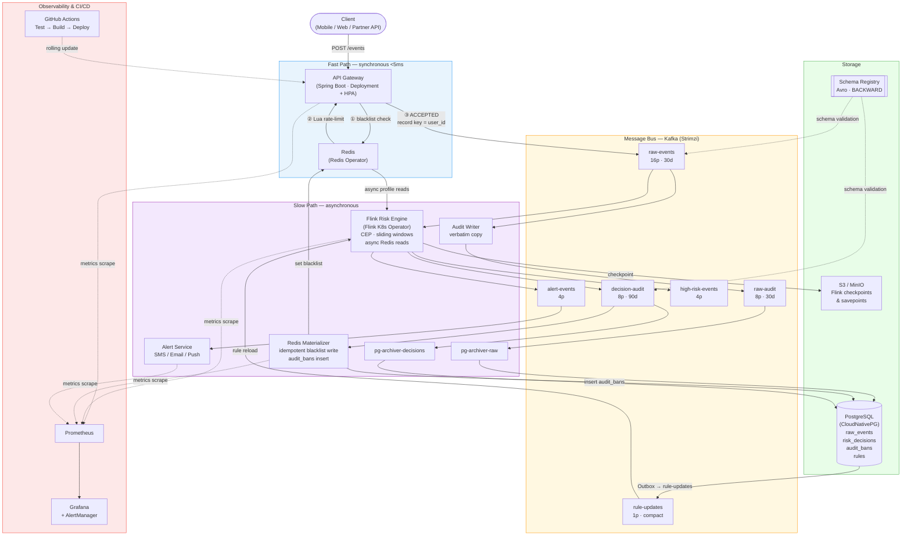

# RealRisk — High-Level Architecture

```mermaid
flowchart TD
    Client(["Client\n(Mobile / Web / Partner API)"])

    Client -->|"POST /events"| GW

    subgraph FastPath["Fast Path — synchronous &lt;5ms"]
        GW["API Gateway\n(Spring Boot · Deployment + HPA)"]
        REDIS["Redis\n(Redis Operator)"]
        GW -->|"① blacklist check"| REDIS
        REDIS -->|"② Lua rate-limit"| GW
    end

    GW -->|"③ ACCEPTED\nrecord key = user_id"| RAW

    subgraph MQ["Message Bus — Kafka (Strimzi)"]
        RAW["raw-events\n16p · 30d"]
        RAWAUDIT["raw-audit\n8p · 30d"]
        DECAUDIT["decision-audit\n8p · 90d"]
        HIGHRISK["high-risk-events\n4p"]
        ALERTEV["alert-events\n4p"]
        RULEUPDATES["rule-updates\n1p · compact"]
    end

    subgraph SlowPath["Slow Path — asynchronous"]
        AW["Audit Writer\nverbatim copy"]
        FLINK["Flink Risk Engine\n(Flink K8s Operator)\nCEP · sliding windows\nasync Redis reads"]
        MAT["Redis Materializer\nidempotent blacklist write\naudit_bans insert"]
        PGRAW["pg-archiver-raw"]
        PGDEC["pg-archiver-decisions"]
        ALERT["Alert Service\nSMS / Email / Push"]
    end

    subgraph Store["Storage"]
        PG[("PostgreSQL\n(CloudNativePG)\nraw_events\nrisk_decisions\naudit_bans\nrules")]
        S3["S3 / MinIO\nFlink checkpoints\n& savepoints"]
        SR[["Schema Registry\nAvro · BACKWARD"]]
    end

    subgraph Ops["Observability & CI/CD"]
        PROM["Prometheus"]
        GRAF["Grafana\n+ AlertManager"]
        CICD["GitHub Actions\nTest → Build → Deploy"]
    end

    RAW --> AW --> RAWAUDIT --> PGRAW --> PG
    RAW --> FLINK
    FLINK --> DECAUDIT
    FLINK --> HIGHRISK
    FLINK --> ALERTEV --> ALERT
    DECAUDIT --> MAT
    MAT -->|"set blacklist"| REDIS
    MAT -->|"insert audit_bans"| PG
    DECAUDIT --> PGDEC --> PG
    FLINK -->|"checkpoint"| S3
    PG -->|"Outbox → rule-updates"| RULEUPDATES
    RULEUPDATES -->|"rule reload"| FLINK
    REDIS -->|"async profile reads"| FLINK

    GW & FLINK & MAT & ALERT -.->|"metrics scrape"| PROM
    PROM --> GRAF
    CICD -.->|"rolling update"| GW
    SR -.->|"schema validation"| RAW & DECAUDIT

    style FastPath fill:#e8f4fd,stroke:#2196F3
    style SlowPath fill:#f3e8fd,stroke:#9C27B0
    style MQ fill:#fff8e1,stroke:#FF9800
    style Store fill:#e8fde8,stroke:#4CAF50
    style Ops fill:#fde8e8,stroke:#F44336
```
